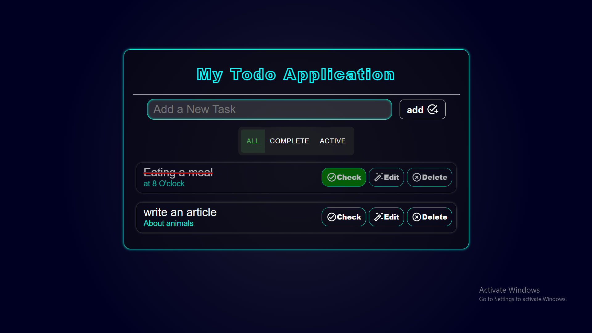
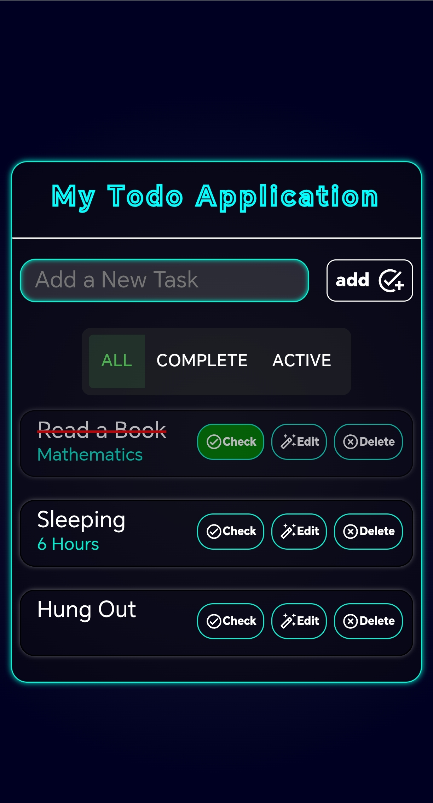

# My Todo Application

A responsive task manager built with **React**, **Vite** and **Material UI**. Add tasks, edit them inline, filter by status, and confirm deletions through animated popups. Tasks are saved in the browser, so they are still there after a refresh.

**Live demo:** [App on vercel](https://my-react-todo-app-eta.vercel.app/)



<p>
  
</p>

## Features

- Add new tasks
- Edit a task's title and details inline
- Mark tasks as complete or active
- Filter the list: All / Complete / Active
- Delete with a confirmation popup
- Toast notification when a task is checked or unchecked
- Empty state message when there are no tasks
- Data persists in `localStorage`
- Responsive layout for desktop, tablet and mobile

## Tech Stack

- **React** (hooks: `useState`, `useEffect`)
- **Vite** for development and the production build
- **Material UI** for the filter toggle, icon buttons and icons
- **Custom CSS** for the neon dark theme, animations and media queries

## Performance

Lighthouse scores on the production build:

| Performance | Accessibility | Best Practices | SEO |
|:-----------:|:-------------:|:--------------:|:---:|
| 99 | 98 | 100 | 91 |

## What I Practiced

- Managing multiple pieces of state and keeping the UI in sync with them
- Persisting data with `localStorage` and a lazy `useState` initializer
- Conditional rendering for edit mode, the empty state and popups
- Mount and unmount animations driven by `onAnimationEnd`
- Fixing real layout bugs: flex centering that clipped the page title, and `position: fixed` overlays
- Responsive design with `min()`, `clamp()` and media queries
- Accessibility basics: label and input linking, placeholders and semantic list markup

## Run Locally

```bash
git clone https://github.com/ALI-cmd-front-developer/My-React-Todo-App.git
cd My-React-Todo-App
npm install
npm run dev
```

Build for production:

```bash
npm run build
npm run preview
```

## Author

**Ali**
[GitHub](https://github.com/ALI-cmd-front-developer)
